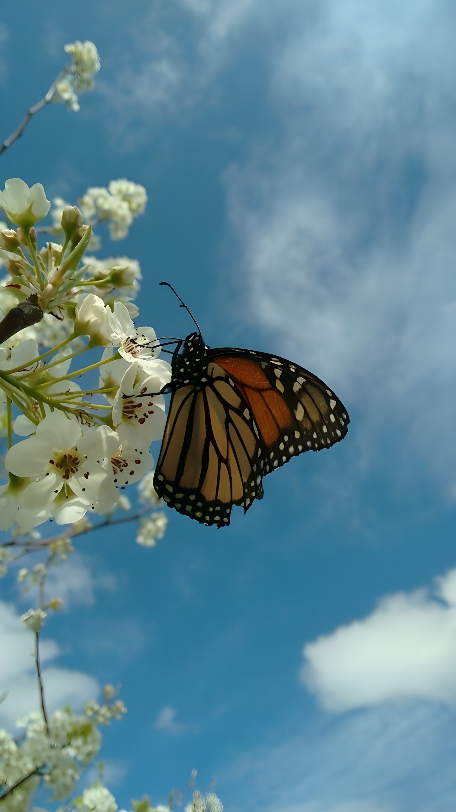

  
  

    <samp>
      i'm aubrey | 18 | she/her/hers
       
      i like music, cli/tui tools & more
       
      experienced in rust, ts/js, c++/c & java
       
       
      i have 6 cats, im fucking awesome
      im okayish when it comes to reverse engineering etc
       
       
      i like messing around with the jvm, rust and writing stuff related to jvmti/jni
       
      currently working on a clientside ac for minecraft & more
       
       
      twt: 
      <a href="https://twitter.com/aubreydll">@aubreydll</a> 
      contact: 
      <a href="mailto:cat@aubrey.rs">cat@aubrey.rs</a> 
       
      silly projects include:
       
      <a href="https://github.com/aubreyrs/silly32">silly32, cpu, written in rust</a> 
      <a href="https://github.com/aubreyrs/LSASS">dumping lsass, written in rust</a> 
      <a href="https://github.com/aubreyrs/mcs">mcs tui for mc player info, in rust</a> 
      <a href="https://github.com/aubreyrs/auth-template">basic auth template, in rust</a> 
      <a href="https://github.com/aubreyrs/antidebug-rs">basic antidebug i wrote, in rust</a> 
      <a href="https://github.com/aubreyrs/clippy">lastfm wrapper, in rust</a> 
      <a href="https://github.com/aubreyrs/ToriClient">dumping a random mc client lol</a> 
    </samp>
  

